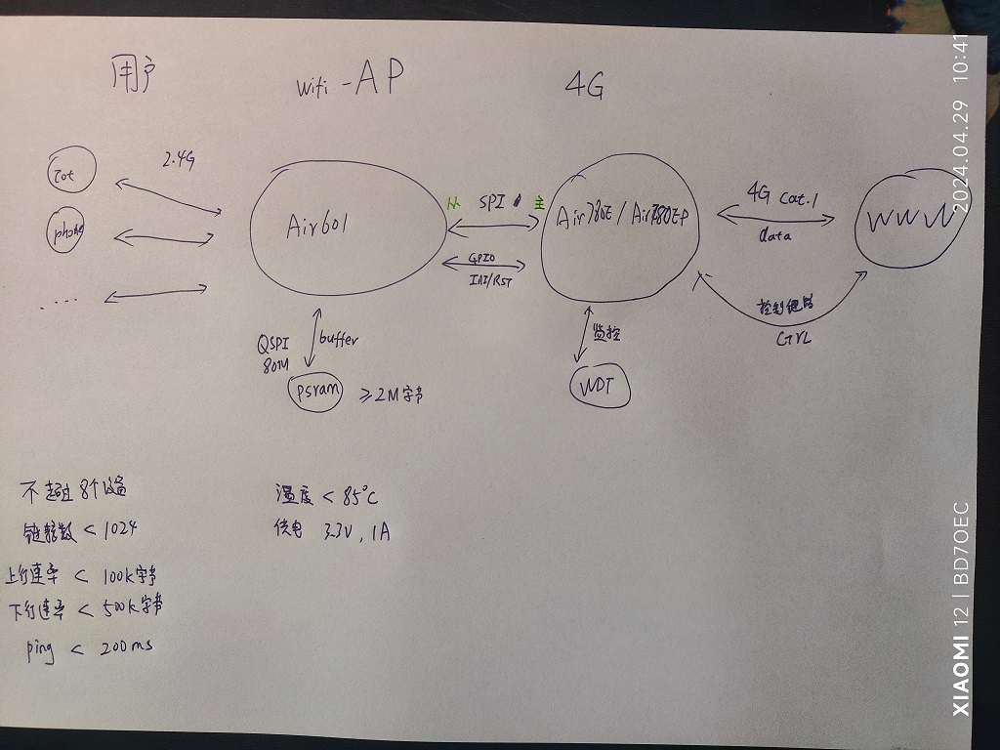

# xt804-spinet

把xt804当网卡用, SPI/SDIO从机接口的, 适用于Air601/W800/W803等基于xt804的芯片

1. 支持STA模式, 作为网卡使用, 主设备通过wifi与内外网通信
2. 支持AP模式, 作为网关使用, 内部设备通过wifi与主设备通信
3. 支持NAPT, 作为路由网关使用(wifi热点), 内网设备通过wifi与外网通信

## 整体架构

## 接线说明

|Air780E         |Air601|说明           |
|----------------|------|---------------|
|3.3v            | 3.3v | 电源          |
|GND             | GND  | 地            |
|SPI0_CS/GPIO8   | PB09 | 片选          |
|SPI0_MOSI/GPIO  | PB10 | 主->从,数据下行|
|SPI0_MISO       | PB11 | 主<-从,数据上行|
|SPI0_CLK        | PB06 | SPI时钟|
|GPIO22          | RESET| 复位, 拉低复位, 暂时不控制不接|

## 目录说明

1. 4g 目录, 给Air780E/Air780EG/Air780EP用的脚本
2. wifi 目录, 给Air601用的脚本
3. doc 目录, 文档

刷机脚本和固件请到release中下载

## 进展

* [x] SPI双向通信
* [x] 命令式通信框架
* [x] 基础命令
* [x] STA模式
* [x] MAC包收发
* [x] TCP/UDP通信
* [x] DNS解析
* [x] DHCP客户端
* [x] TLS/HTTPS/MQTTS通信
* [x] AP模式
* [x] DHCP服务器端
* [x] DNS代理
* [x] **NAPT** 路由协议
* [x] 优化性能到10k下行, 10k上行
* [ ] 优化性能到50k下行, 50k上行
* [ ] 优化性能到100k下行, 50k上行

## 工作原理简介

1. Air601支持SPI/SDIO从机, 其中SPI最高50M, SDIO最高100M
2. Air780E/Air780EP等支持SPI主机, 其中Air780E最高25.6M, Air780EP最高51.2M

## 版本记录

看文件 [版本记录](CHANGELOG.md)

## LICENSE

MIT
